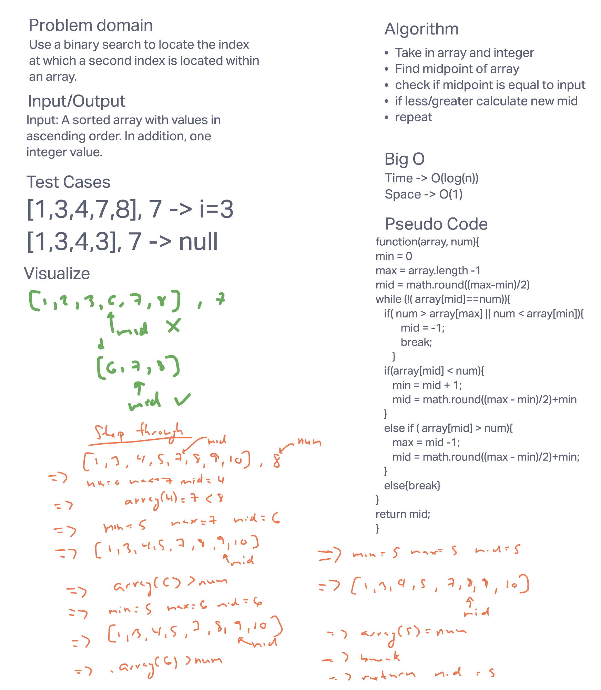

# Early 401 Code Challenges

## Java Code Challenge 1

### Solution

#### Description

Reverse an array of any size by using linear time and constant space.

Solve time: 30 min

## Java Code Challenge 2

### Solution 2

#### Description 2

Take in an array and a new element and insert that new element into the midpoint of the array. Output a new array with a length one larger than the input array which includes the new element.

Solve time: 40 min

## Java Code Challenge 3

### Solution 3

#### Description 3

Search through an array using binary search. This method decreases the size of the array by a factor of two each query. This allows for an array to be searched in log(n) time, where n is the length of the array. The space complexity is constant, O(1). The output is the index for the integer input.

Solve time: 40 min
