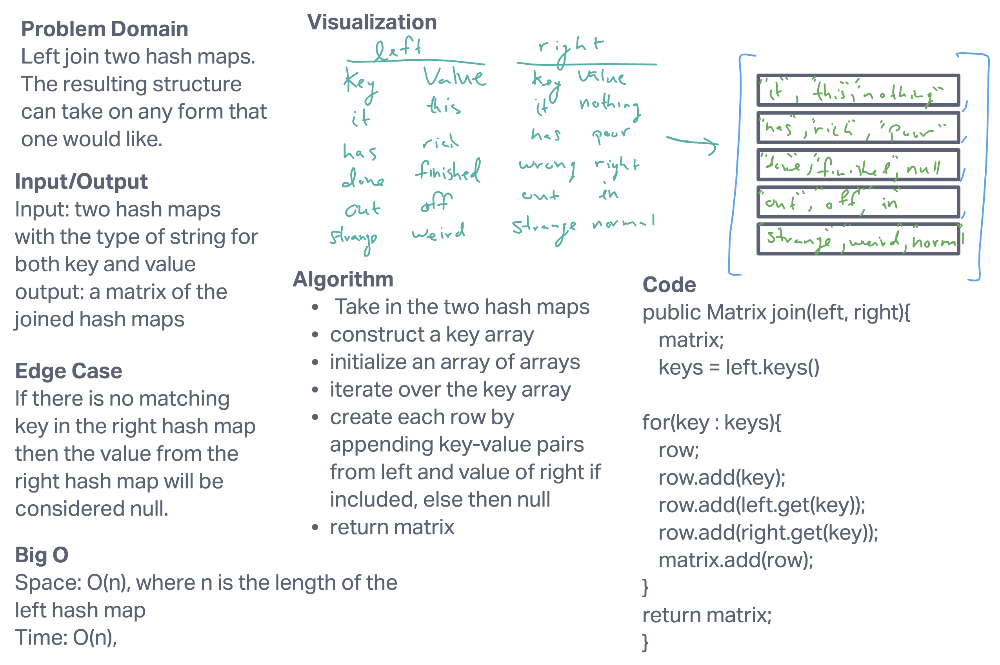

# Challenge Summary: Tree FizzBuzz

Write a function that takes in two hash maps and return a data structures that joins them following the logic of left join. I did this by outputting a matrix that has rows that contain the key and value of the first hashmap and the value of the corresponding key of the second hash map. If the second hash map does not contain the key then the value in the row is `null`.

## Whiteboard Process

## Approach & Efficiency

The keys from the first hash map are iterated over and them fed into an array. The values are also added from both the left and right hash map.

`ArrayList<ArrayList<String>> hashMapJoin(ArrayList<String> left, ArrayList<String> right)`: this function returns a matrix of strings. The length of each row is three. [Space O(n); Time O(n)]

## Solution

See my code here:
[code](../../codechallenges/hashmap/HashMapJoin.java)

See the tests I used on my code here:
[tests](../../../../test/java/codechallenges/hashmap/HashMapJoinTest.java)
