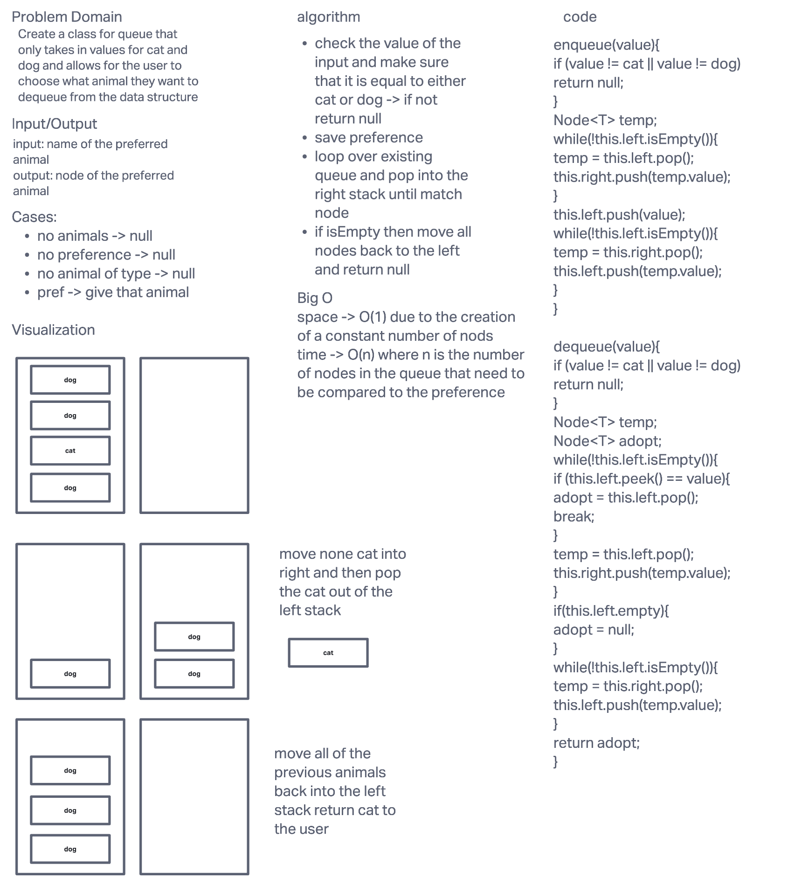

# Challenge Summary: Pseudo Queue

Write a class that follows the FIFO (first in first out) principle but uses two stacks as the architecture. In particular, two methods must be part of this data structure, enqueue and dequeue.

## Whiteboard Process

## Approach & Efficiency

Two stacks are used. The pseudo queue has two properties of `left` and `right`, which have the type of `Stack`. Stack is a class that has the methods of pop, push, peek, and is empty that are typical of a stack data structure. The resting state of pseudo queue has its node sitting in the left stack.

Dequeue: elements are popped from the left stack.

O(1) for both space and time complexity.

Enqueue: nodes are popped and the pushed to the right stack. Once the left stack is empty the new node is push to the left stack. The right stack is then fully popped and those nodes are pushed to the left stack. The left stack now has an additional node at the base of the stack. This system ensure that the FIFO principle is being followed.

This has a space complexity of O(n) because the number of new nodes created is proportional to the number of nodes that already exist in the left stack. The time complexity if O(n) because the transfer between the two stacks is again proportional to the number of nodes in the left stack.

## Solution

[code](../stackqueue/StackQueueAnimalShelter.java)

[tests](../../../../test/java/codechallenges/stackqueue/StackQueueAnimalShelterTest.java)
