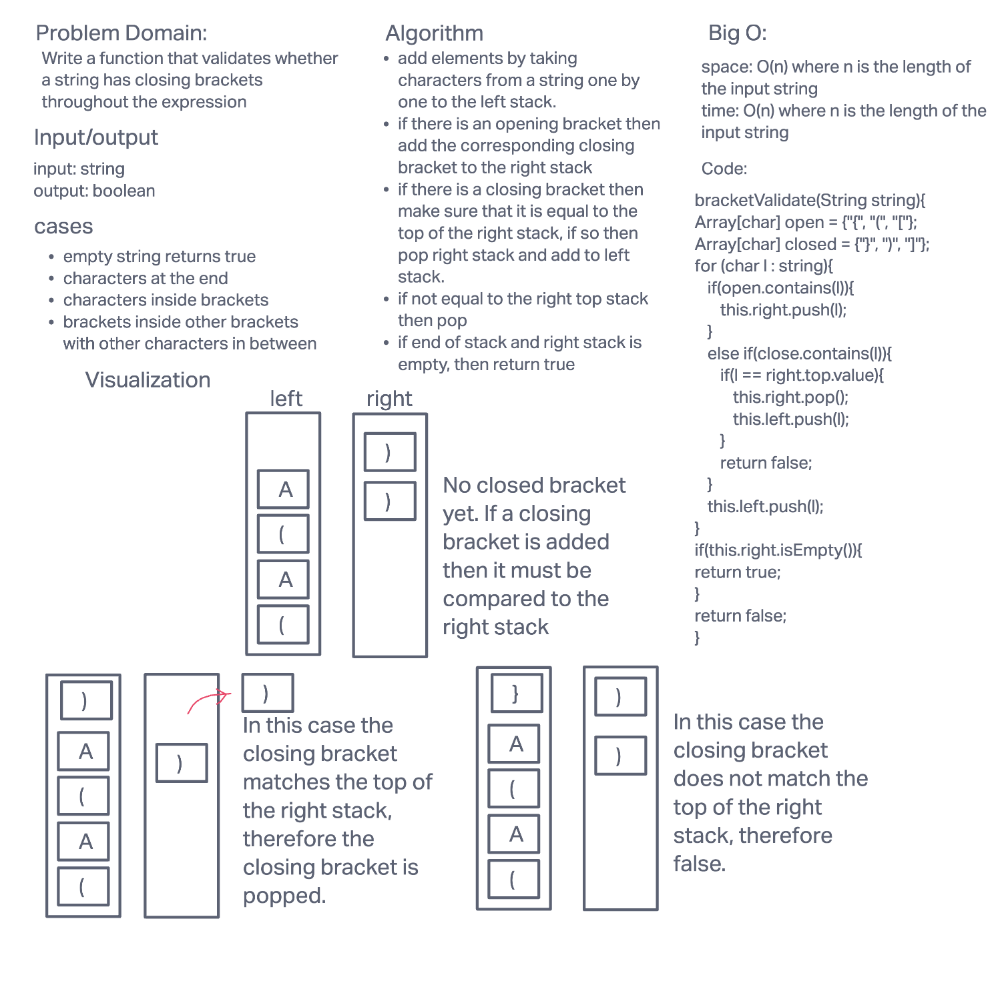

# Challenge Summary: Stack Queue Animal Shelter

Write a function that will take in a string and determine if the string contains any brackets that are not closed appropriately. Brackets can be either `{}`, `[]`, or `()`. Brackets must first open in the string before a closed bracket of that type appears in the string. Brackets can be nested, however, the inner nested brackets must close before the outer nested brackets close.

## Whiteboard Process

## Approach & Efficiency

This method calls upon a double stack approach that is accessed through the `PseudoQueue` class. However, the queue aspect of this class is not used. Instead, the structure of the left and right stack are used.

The left stack will take new nodes as long as certain conditions are met. First, the incoming value must be a non-bracket character or correspond to the bracket on the top of the right stack.

The time complexity is O(n) where n is the number of characters in the input string. The space complexity is also O(n) for the same reason. 

## Solution

[code](../stackqueue/StackQueueBrackets.java)

[tests](../../../../test/java/codechallenges/stackqueue/PseudoQueueTest.java)
