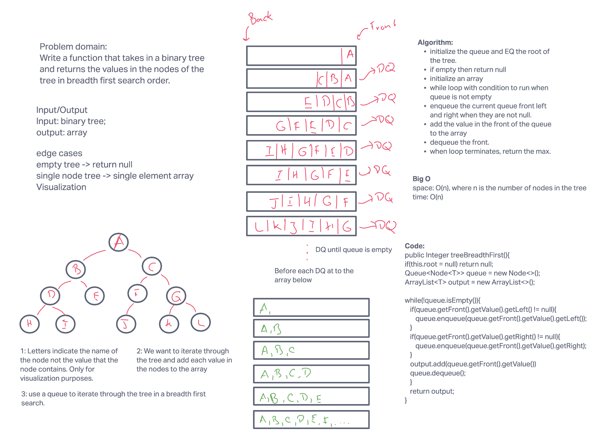
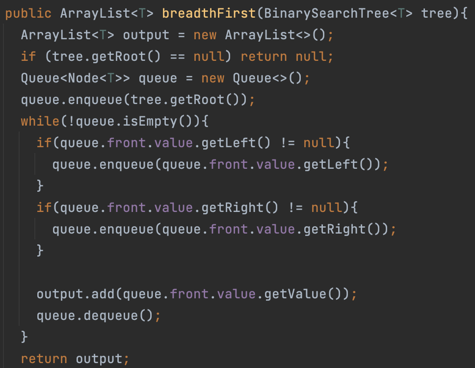

# Challenge Summary: Tree Breadth First

Write a function that takes in a binary tree and returns an array that lists the values within the tree in breadth first search order.

## Whiteboard Process

## Approach & Efficiency

The tree is traversed using a breadth first search algorithm. Before items are `dequeued` from the queue the value of the front node is added to an `ArrayList`. This process is repeated for all nodes in the queue. One the queue is empty, the `ArrayList` is returned.

`ArrayList TreeBreadthFirst(BinaryTree tree)`: This function has a time complexity of O(n), where n is the number of nodes in the `BinaryTree`. The enqueue and dequeue methods are O(1), which allows for the overall process to remain linear with the number of tree nodes. The space complexity is also O(n) because n nodes must be initialized in the enqueue process.

## Solution

See my code here:
[code](../tree/TreeBreadthFirst.java)

See the tests I used on my code here:
[tests](../../../../test/java/codechallenges/tree/TreeBreadthFirstTest.java)
