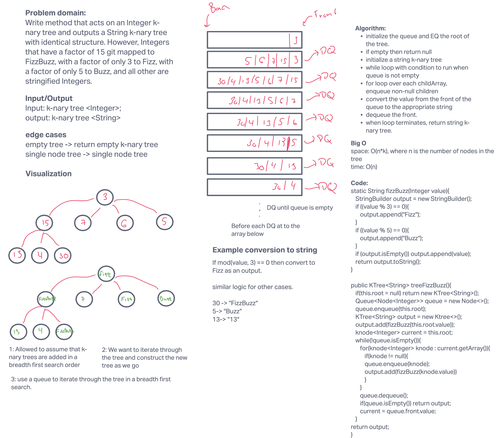
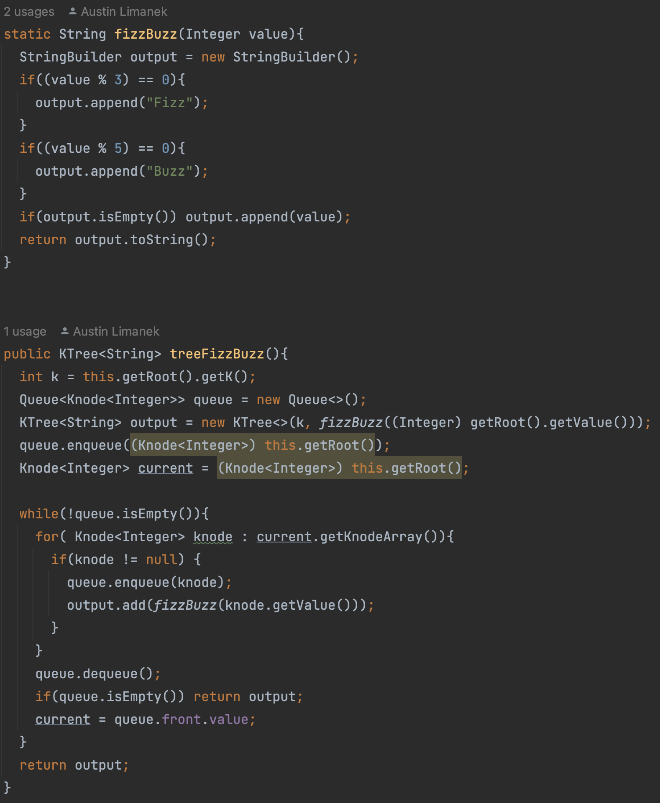

# Challenge Summary: Tree FizzBuzz

Write a method that acts on an integer k-nary tree and outputs a String k-nary tree with identical structure. However, Integers that hava a factor of 15 git mapped to `FizzBuzz`, with a factor of 3 to `Fizz`, with a factor of 5 to `Buzz`, and all other are stringified Integers.

## Whiteboard Process

## Approach & Efficiency

The tree is traversed using a breadth first search algorithm. Before items are `dequeued` from the queue the value of node is converted into the appropriate string form. This process is repeated for all nodes in the queue. Once the queue is empty, the `KTree<String>` is returned.

`KTree<String> treeFizzBuzz(KTree<Integer> tree)`: This function has a time complexity of O(n), where n is the number of nodes in the `KTree`. The enqueue and dequeue methods are O(1), which allows for the overall process to remain linear with the number of tree nodes. The space complexity is also O(n) because n nodes must be initialized in the enqueue process.

## Solution

See my code here:
[code](../../datastructures/tree/KTree.java)

See the tests I used on my code here:
[tests](../../../../test/java/datastructures/tree/BinaryTreeTest.java)
