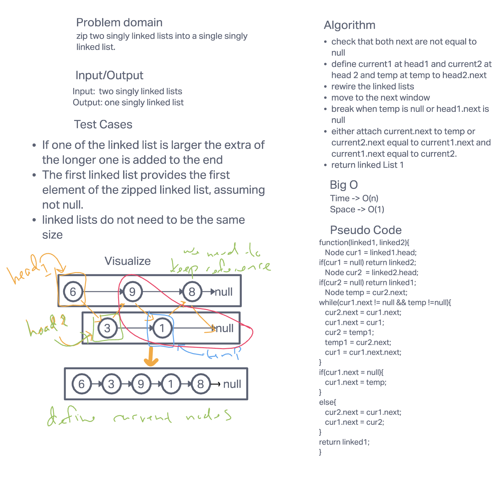
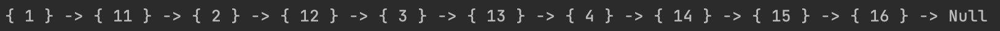

# Challenge Summary: Zip Two Linked Lists

Write a function that takes in two singly linked lists and output a single linked list that has the two linked lists nodes alternating. The first node should be from the `head` of the first linked list. The two linked lists do not need to be the same size. However, they must be the same type.

## Whiteboard Process

## Approach & Efficiency

I took the apporach of using three pointers. One pointer on the first linked list and two pointers on the second linked list. These pointers hold the nodes to preserve references. The linked lists are interated over simultaniously. Since the lengths can be of different size, there are two scenarios for the final augmentations. The space complexity is O(1) because the number of additional Nodes is at most three. The time complexity is O(n) because the length (of the shortest linked list) is of size n.

## Solution

[code](../linkedlist/LinkedListChallenges.java)

[tests](../../../../test/java/codechallenges/linkedlist/LinkedListChallengesTest.java)

This shows the merging of a linked list with the values of 1, 2, 3, 4 being merged with a second linked list with values of 11, 12, 13, 14, 15, 16

