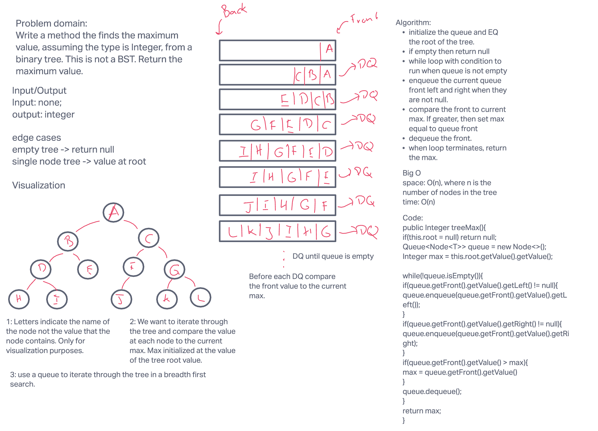
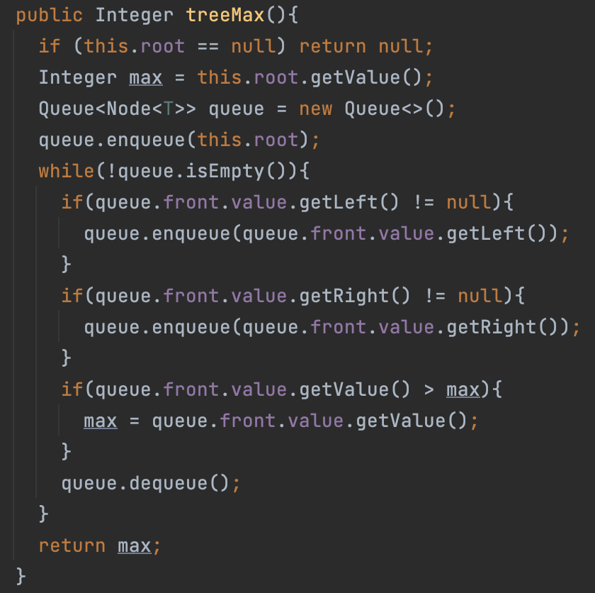

# Trees

## Code Links

[Node](../tree/Node.java)

[Binary Tree](../tree/BinaryTree.java)

[Binary Search Tree](../tree/BinarySearchTree.java)

## Challenge

Create three classes that define the behavior of a binary search tree. In this implementation the values of nodes in the trees are `Integers`. When nodes are added to the binary search tree they are added according to their relative value to the existing nodes - smaller values will be filtered left and larger values filtered right.

## Features, Approach, Efficiency, and API

### Node

Nodes contain a value of type `Integer`. This class has the fields of `left` and `right`, which are both of type `Node`. Initialization is [Space O(1); Time O(1)].

### Binary Tree

`BinaryTree` class the field of `root` of type `Node`. There are two possible constructors: one with 0 arguments that has a root with a value of `null`, and one with a single argument of type `Integer` with the root taking on the value of the argument.

- `preOrder()`: a method that returns an `ArrayList<Integer>`. The array is ordered following `root -> left -> right`. This method recursively adds the nodes to the array. [Space O(n); Time O(n)]
- `inOrder()`: a method that returns an `ArrayList<Integer>`. The array is ordered following `left -> root -> right`. This method recursively adds the nodes to the array. [Space O(n); Time O(n)]
- `postOrder()`: a method that returns an `ArrayList<Integer>`. The array is ordered following `left -> right -> root`. This method recursively adds the nodes to the array. [Space O(n); Time O(n)]
- `treeMax()`: a method that returns an `Integer` that is the max value of the binary tree. This is done by using a breadth first search type algorithm. [Space O(n); Time O(n)]

### Binary Search Tree

Extends `BinaryTree` and inherits both constructors with no additions. However, the following methods expand the parent class:

- `void add(Integer value)`: This method adds a node to the tree based on the relative value of the input. The input is iteratively compared to the value of existing nodes in the tree. If the input is less than the current node, then move left; if greater, move right. This continues until a current null points to a null in the appropriate direction.  [Space O(1); Time O(log(n))]
- `boolean contains(Integer value)`: Compares the input value iteratively to existing nodes in the tree. Starting at the root, if the value is smaller, then check left; if larger, check right; and if equal, return true. If the next node is null then return false. [Space O(1); Time O(log(n))]

## Specifications & Tests

[Testing Code](../../../../test/java/datastructures/tree/BinaryTreeTest.java)

- [x] Can successfully instantiate an empty tree
- [x] Can successfully instantiate a tree with a single root node
- [x] For a Binary Search Tree, can successfully add a left child and right child properly to a node
- [x] Can successfully return a collection from a preorder traversal
- [x] Can successfully return a collection from an inorder traversal
- [x] Can successfully return a collection from a postorder traversal
- [x] Returns true	false for the contains method, given an existing or non-existing node value
- [x] Return a null for `treeMax()` when a binary tree is empty
- [x] Return the value at the root for `treeMax()` when the binary tree only has one node
- [x] Returns the correct max value from a binary tree of many nodes
