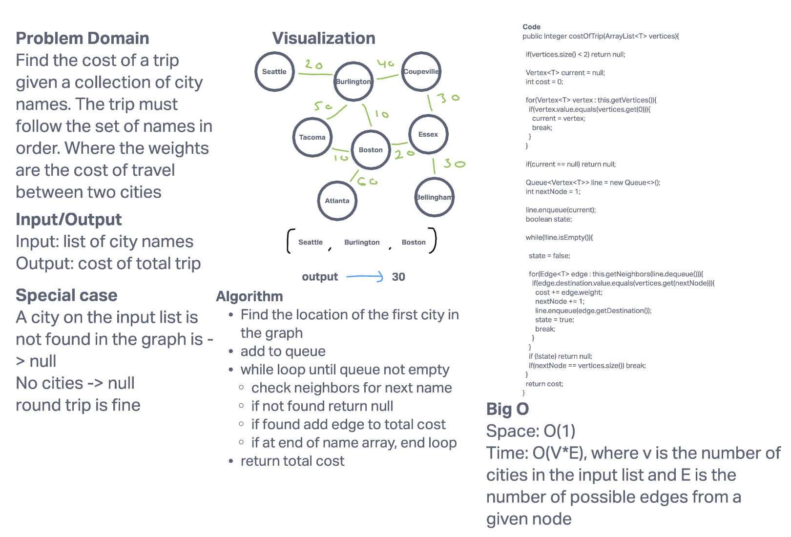

# Graph

[Implementation Code](../graph/Graph.java)

[Testing Code](../../../../test/java/datastructures/graph/GraphTest.java)

## Challenge

Implement a graph that is based on an adjacency matrix. The rows are labeled by the vertex and the elements of each row are the unidirectional connection between this rows vertex and the other vertices that are part of the graph. Each `Vertex` is connected by an `Edge`. `Edges` are only one way. However, two vertices are able to point at one another.

## Features

- [x] addVertex: successfully add a vertex to the adjacency matrix [Space O(1); Time O(1)]
- [x] addEdge: successfully adds an edge to the adjacency matrix [Space O(1); Time O(1)]
- [x] getVertices: pulls from the adjacency matrix each of the keys [Space O(1); Time O(1)]
- [x] getNeighbors: pulls from a given key each of the connections for a given vertex [Space O(1); Time O(1)]
- [x] size: returns the number of uniques vertices in the graph [Space O(1); Time O(1)]
- [x] toString: prints the vertices followed by their unidirectional edges to other vertices in the graph. [Space O(V*E); Time O(1)]
- [x] printBFS: Returns the values of the vertices in the order corresponding to breadth first search. [Space O(V); Time O(V+E)]

## Specifications & Tests

### Day 1 - Initialized the class

- [x] Node can be successfully added to the graph
- [x] An edge can be successfully added to the graph
- [x] A collection of all nodes can be properly retrieved from the graph
- [x] All appropriate neighbors can be retrieved from the graph
- [x] Neighbors are returned with the weight between nodes included
- [x] The proper size is returned, representing the number of nodes in the graph
- [x] A graph with only one node and edge can be properly returned

### Day 2 - Added a printBFS method

- [x] Graph has the appropriate size regardless of the number of edges add to the graph
- [x] The output of printBFS matches the number of vertices in the graph
- [x] Breadth first search order is achieved

### Day 3 - Trip Cost

- [x] returns null if the input array is empty or does not have a matching name with that of the graph
- [x] returns the total cost of trip for one way, two-way, and many linked destination trips
- [x] single city itinerary returns null
